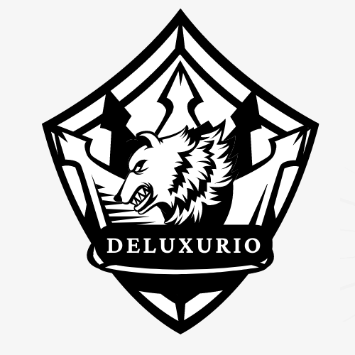

# Say-this-is-NWONaturehtmlwebsite
To lessen the paper required to print 

<!DOCTYPE html>
<html lang="en">
<head>
    <meta charset="UTF-8">
    <meta http-equiv="X-UA-Compatible" content="IE=edge">
    <meta name="viewport" content="width=device-width, initial-scale=1.0">
	<link rel="stylesheet" href="style.css">
    <title>NWONature</title>
	
</head>
<body>
	

	

		<h1></h1>
		
	

	

		<button><a href="Menuo.html" target="_blank" title="redirect-to-homepage 🔒Connection Secure">🏡</button>
		<button><a href="AboutDevelopers.html" target="_blank" title="About the two Wise Creator Page 🔒Connection Secure">👨‍💻</button></a>
		<button><a href="ContactUs.html" target="_blank" title="Need More Information? Contact Us 🔒Connection Secure"> 📞</a></button>
		<button><a href="LoginRSignup.html" target="_blank" title="redirect-to-LoginRSignup/forgot Password 🔒Connection Secure">
			<a href="Profile.html" target="_blank" title="redirect-to-Profile Page 🔒Connection Secure">
👤🏼 </button></a></a>
	

	

    

</head>
<body>
	    <header>
        

                    

                    <header style="color: transparent;">
        <h1 style="display: flex; align-items: center;">

        	
</head>
<body>
  

    Nature Wander Outdoor      
  
 </h1></header>

        
      <header style="display: flex; align-items: center;" style="color: transparent;">

      	

             <nav class="navbar" style="color: transparent;">
            <ul style="color: transparent;">
                <li style="color: white;">Blog<a href="https://emyrbrielfd.wixsite.com/redirect-to-homepage/post/ultimate-warship-the-leviathan-carrier-xt" target="_blank" title="Wix Website Blog">📝</a></li>
   
                 <li style="color: white;">Community<a href="Community Events Rewards.html" target="_blank" title="Community Page 🔒Connection Secure">🌍</a></li>
                 <li style="color: white;">Rewards<a href="https://rewards.bing.com/redeem/" title="Rewards from Microsoft 🔒Connection Secure" target="_blank">🎉</a></li>
                 <li style="color: white;">Contact Us<a href="Feedback Form.html" target="_blank" title="Any Suggestion's on Mind? Contact Us">🤔</a></li>
   

    	<li>

  <input type="text" id="search-input" placeholder="Search...">
  <button id="search-button" type="button">
    <svg xmlns="http://www.w3.org/2000/svg" viewBox="0 0 24 24">
      <path d="M21.7 20.3l-4.5-4.5C17.2 14.2 18 12.2 18 10c0-4.4-3.6-8-8-8S2 5.6 2 10s3.6 8 8 8c2.2 0 4.2-.8 5.8-2.2l4.5 4.5c.4.4 1 .4 1.4 0 .4-.4.4-1 0-1.4zM10 16c-3.3 0-6-2.7-6-6s2.7-6 6-6 6 2.7 6 6-2.7 6-6 6z"/>
    </svg>
  </button>

 </li>

            </ul>
        </nav>
    </header>

     
   

</header>
<iframe style="border-radius:12px" src="https://open.spotify.com/embed/playlist/1G61uyHPiuBl6fHrROrX4W?utm_source=generator" width="auto" height="auto" frameBorder="0" allowfullscreen="" allow="autoplay; clipboard-write; encrypted-media; fullscreen; picture-in-picture" loading="lazy" align="right"></iframe>

 
  
 

  <H2 class="hover-trigger">Check What's New Today </h2>

  

    <h4 style="color: black;">  

  <button class="filter-button active" data-category="all">All</button>
  <button class="filter-button" data-category="politics">Politics</button>
  <button class="filter-button" data-category="business">Business</button>
  <button class="filter-button" data-category="sports">Sports</button>

  
News item about politics

  
News item about business

  
News item about sports

  
Another news item about politics

  
Another news item about sports

</a>

 </li>

  

 
</body>
</html>
